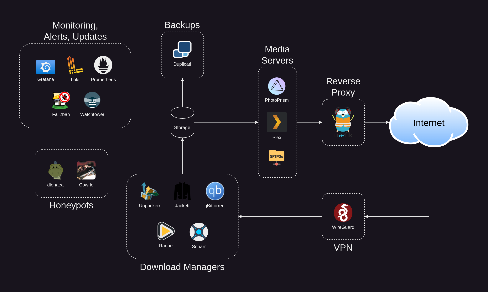
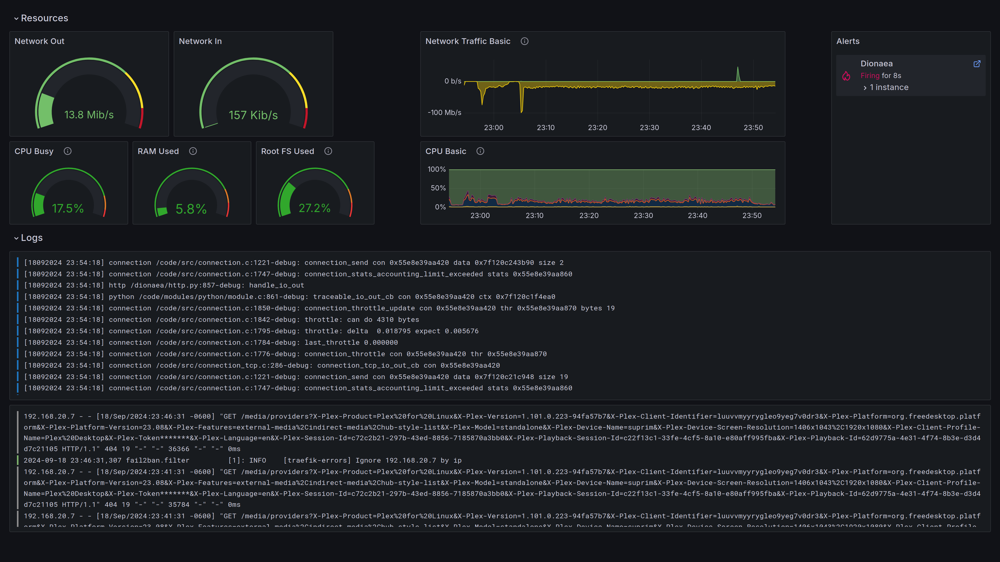
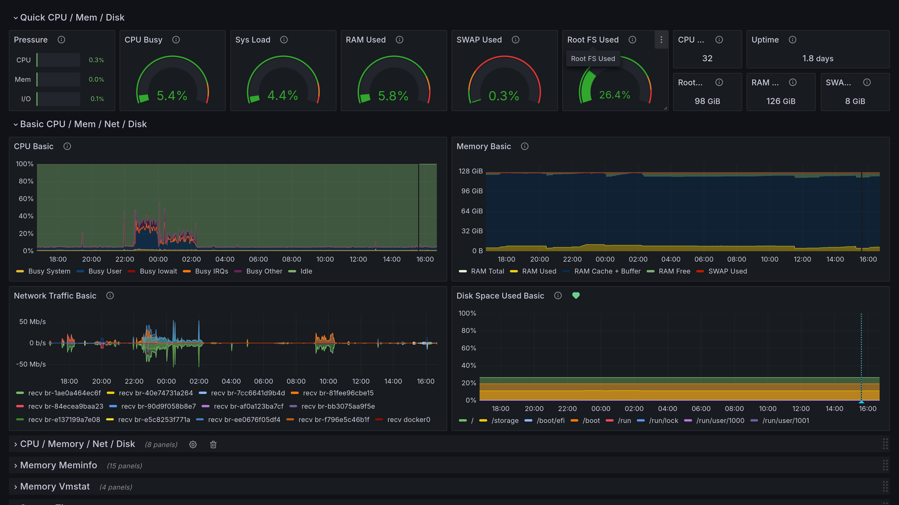
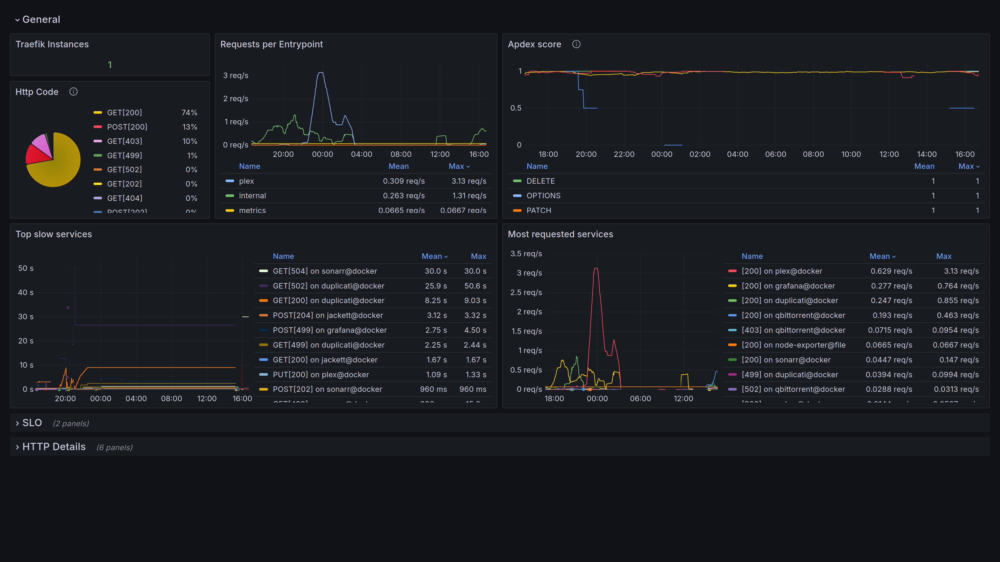

# klack.cloud
A secure, monitored, self-hosted replacement for iCloud, Google Photos, Dropbox, Evernote, Netflix and more.


# Goals
- Reduce your dependence on cloud services
- Eliminate subscription costs
- Increase your privacy
- Limit data collected by free services
- Limit your exposure to AI, advertisers, and scammers
- Own and control your data
- Prevent phone and vendor lock in
# Dashboards
### Overview

### System

### Services


# Features
- 📺 Video Server
  - Plex
- 📷 Photo Gallery
  - PhotoPrism
- 🔄 Photo sync, Note sync, Cloud storage
  - SFTPGo
- 🔐 SSL and Basic Auth
  - Traefik
- ⛔ Ban bots and failed login attempts automatically
  - Fail2Ban
- 🚨 📊 📃 Log aggregation, dashboards and alerts
  - Grafana, Promtail, loki
- 📈 HTTP Stats, System Stats
  - Prometheus, Node Exporter
- ♻️ Rotate logs to preserve hard disk space
  - logrotate
- 🍯 Honeypots for SSH, HTTP, SMB and more
  - Cowrie, Dionaea
- 💾 Incremental Backups
  - Duplicati
- ⚙️ Auto update docker images
  - Watchtower
- 🌀 bittorrent and with VPN killswitch
  - qBittorrent-wireguard
- 📥 Download Managers
  - Sonarr for TV
  - Radarr for Movies
  - Jackett for searching
  - Unpackerr to handle compressed files

# Setup
### Pre-requisites
- [ ] A free domain configured with Dynamic DNS, such as one from [No-IP](https://noip.com)
- [ ] Port 443 must be allowed by your ISP
- [ ] Port 443 and 32400 must be forwarded to your machine from your router
- [ ] SMTP server settings from your ISP
- [ ] A [paid VPN subscription](https://protonvpn.com/) if you wish to use "Download Managers"
  - Login to your VPN provider and [download a wireguard.conf file](https://protonvpn.com/support/wireguard-configurations/)
  - Place it at `./config/wireguard/wg0.conf`

### Notes
- Since you are using a self-signed cert, you will need to accept a security exception in your browser for each service.

### Run the following commands to begin
```bash
git clone https://github.com/klack/klack.cloud.git
cd klack.cloud
./setup.sh
```

## Cloud Drive
  - Use the following settings
    - User: `cloud`
    - Password: Your password
    - WebDAV URL: `https://your-domain.com/dav`  
  - Windows
    - Click on the Start icon/Windows icon  
    - Go into "This PC"
    - In the toolbar choose the option "Computer"
    - Click on "Map Network drive"
    - Fill in the *WebDAV URL*
  - Mac
    - Open the Finder on your computer
    - Click on the "Go" menu and select "Connect to Server"
    - In the new window enter the *WebDAV URL* and click on "Connect"
  - Linux (Gnome Desktop)
    - Open Nautilus file manager
    - Choose "Other Locations" from the menu on the left
    - Type the *WebDAV URL* into "Connect to Server" field
    - Change https:// to davs://
  - Chromebook
    - `sudo mount -t davfs https://your-domain.com/dav/ /home/localuser/klackcloud`
  - iPhone
    - Download [Documents: File Manager & Docs by Readdle](https://apps.apple.com/us/app/documents-file-manager-docs/id364901807)
    - [Setup WebDAV](https://support.readdle.com/documents/transfer-share-your-files/transfer-files-to-another-ios-device-with-webdav) using the *WebDAV URL*

## Photo Sync
- Setup [PhotoSync](https://www.photosync-app.com/home) for your phone
    - **Note this is a paid app** - Looking for a better solution
    - Open the app and navigate to Settings > Configure > WebDAV > Add New Configuration...  
      - Server: `your-domain.com`  
      - Port: `443`  
      - Login: `cloud`
      - Password: Your password
      - Directory: `/dav/Photos`
      - Use SSL: On
    - Tap "Done"
    - You can now use the red sync button and choose WebDAV
- View your photos from any device at https://your-domain.com/photos 

## Notebook Sync
Setup notebook sync with [Joplin](https://joplinapp.org/help/install/)
  - Open the app
  - Navigate to Options > synchronization
  - Set "Synchronization target" to "WebDAV"
  - Enter `https://your-domain/dav/Notes` for the "WebDAV URL"
  - Enter `cloud` for "WebDAV username"
  - Enter your password for "WebDAV password"
  - Click "Check synchronization configuration"
  - Upon success click "Show Advanced Settings"
  - Click "Re-upload local data to sync target"

## Alerts
You will receive email alerts for the following:
- High CPU temp (or no temp reported)  
- Low Disk space  
- High Ram utilization  
- High CPU utilization  
- Backup failures  
- Honeypot activities  

## Backups
Documents, Notes and Photos are automatically backed up at 1:00PM.  If there is a backup failure, you will receive an alert.  To manage backups, open [Duplicati](https://duplicati.your-domain.internal:4443/)

### Download Managers
- Use `/data/library/tv/` as a path when adding a series in sonarr
- Use `/data/library/movies/` as a path when adding a movie on radarr
- Use `http://localhost:9117` for the Jackett address when creating a torznab indexer
- In qBittorrent set "Bypass authentication for clients on localhost"


# Service Directory
| Service       | Port  | Domain                           | Hosted Path | URL                                                | Service URL            | Auth Provider | Log Rotation  |
| ------------- | ----- | -------------------------------- | ----------- | -------------------------------------------------- | ---------------------- | ------------- | ------------- |
| Plex          | 32400 | your-domain.com                  | /           | https://your-domain.com:32400/                     |                        | App           | Self          |
| PhotoPrism    | 443   | your-domain.com                  | /photos     | https://your-domain.com/photos                     |                        | App           | Docker        |
| WebDav        | 443   | your-domain.com                  | /dav        | https://your-domain.com/dav/                       |                        | Traefik       | Docker        |
| SFTPGo UI     | 4443  | sftpgo.your-domain.internal      | /           | https://sftpgo.your-domain.internal:4443/          |                        | Traefik       | Docker        |
| Traefik UI    | 4443  | traefik.your-domain.internal     | /           | https://traefik.your-domain.internal:4443/         |                        | Traefik       | logrotate     |
| Grafana       | 4443  | grafana.your-domain.internal     | /           | https://grafana.your-domain.internal:4443/         |                        | App           | Docker        |
| Prometheus    | 4443  | prometheus.your-domain.internal  | /           | https://prometheus.your-domain.internal:4443/      | http://prometheus:9090 | Traefk        | Docker        |
| Loki          |       |                                  |             |                                                    | http://loki:3100       |               | Docker        |
| Node Exporter | 9101  | node-exp.your-domain.internal    | /           | https://node-exp.your-domain.internal:9101/metrics |                        | IPTABLES      | stdout        |
| Duplicati     | 4443  | duplicati.your-domain.internal   | /           | https://duplicati.your-domain.internal:4443/       |                        | Traefik       | logrotate     |
| qBittorrent   | 4443  | qbittorrent.your-domain.internal | /           | https://qbittorrent.your-domain.internal:4443/     |                        | App           | logs disabled |
| Jackett       | 4443  | jackett.your-domain.internal     | /           | https://jackett.your-domain.internal:4443/         | http://localhost:9117  | Traefik       | logs disabled |
| Sonarr        | 4443  | sonarr.your-domain.internal      | /           | https://sonarr.your-domain.internal:4443/          |                        | App           | Self          |
| Radarr        | 4443  | radarr.your-domain.internal      | /           | https://radarr.your-domain.internal:4443/          |                        | App           | Self          |
| Cowrie        | 22,23 |                                  |             |                                                    |                        |               | logrotate     |
| Dionaea       | ~     |                                  |             |                                                    |                        |               | logrotate     |

# Notes
### Stats
Node exporter is run on the host machine and read by the prometheus docker instance.  
IPTable rules should be created so that only this docker container can talk to node exporter
  - `sudo iptables -A INPUT -p tcp -s 172.17.0.0/16 --dport 9100 -j ACCEPT`
  - `sudo iptables -A INPUT -p tcp --dport 9100 -j DROP`

### Log Rotation
Is setup on the host machine due to permission issues and the requirement to send SIGHUP signals  

### Honeypots
Honeypot's cannot be accessed by localhost due to macvlan network

### Custom CA Cert
To use your own ca-signed certificates rename `config/traefik/dynamic/certs.yml.example` to `config/traefik/dynamic/certs.yml` and place `ca.crt`,`server.crt`, and `server.key` in `config/traefik/certs`

# Uninstall
Run `./setup.sh --clean`  
Remove entry for `node_exporter` from `/etc/crontab` on your host machine  
Remove entries from `/etc/hosts` on your server and your local machine  