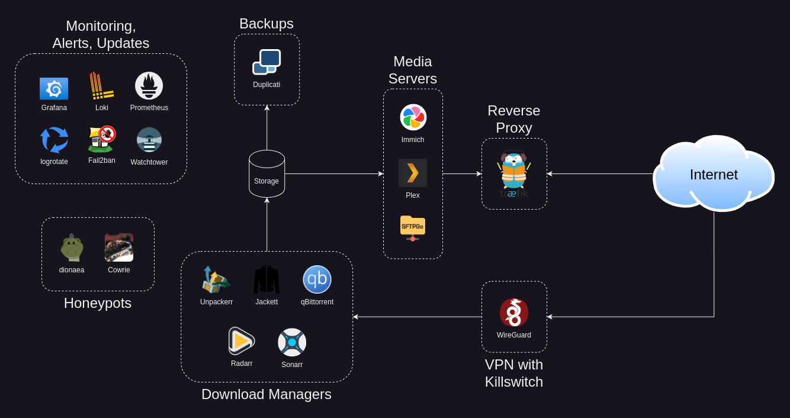

# klack.cloud
 An example of a self-hosted, microservice based, replacement for iCloud, Google Photos, Evernote, Netflix and more. Secure and monitored. 
 

### Goals
- Reduce your dependence on cloud services
- Eliminate subscription costs
- Increase your privacy
- Limit data collected by free services
- Limit your exposure to AI, advertisers, and scammers
- Own and control your data
- Prevent phone and vendor lock in

### Overview Dashboard

### System Dashboard


# Features
- 📺 Video Server
  - [Plex](https://www.plex.tv/)
- 📷 Photo Gallery
  - [Immich](https://immich.app/)
- 🔄 Cloud storage, Note sync
  - [SFTPGo](https://sftpgo.com/)
- 🔐 SSL and Basic Auth
  - [Traefik](https://traefik.io/traefik/)
- ⛔ Ban bots and failed login attempts automatically
  - [Fail2ban](https://github.com/fail2ban/fail2ban/wiki)
- 🚨 📊 📃 Log aggregation, dashboards and alerts
  - [Grafana](https://grafana.com/), [Promtail](https://grafana.com/docs/loki/latest/send-data/promtail/), [loki](https://grafana.com/oss/loki/)
- 📈 HTTP Stats, System Stats
  - [Prometheus](https://prometheus.io/docs/visualization/grafana/), [Node Exporter](https://prometheus.io/docs/guides/node-exporter/)
- ♻️ Rotate logs to preserve hard disk space
  - [logrotate](https://github.com/logrotate/logrotate)
- 🍯 Honeypots for SSH, HTTP, SMB and more
  - [Cowrie](https://cowrie.readthedocs.io/en/latest/index.html), [Dionaea](https://dionaea.readthedocs.io/)
- 💾 Incremental Backups
  - [Duplicati](https://duplicati.com/)
- ⚙️ Auto update docker images
  - [Watchtower](https://containrrr.dev/watchtower/)
- 🌀 bittorrent with VPN killswitch
  - [qBittorrent-wireguard](https://github.com/tenseiken/docker-qbittorrent-wireguard)
- 📥 Download Managers
  - [Sonarr](https://sonarr.tv/) for TV
  - [Radarr](https://radarr.video/) for Movies
  - [Jackett](https://github.com/Jackett/Jackett) for searching
  - [Unpackerr](https://github.com/Unpackerr/unpackerr) to handle compressed files

# Setup
### Pre-requisites
- [ ] Linux with Docker installed: [Ubuntu Instructions](https://docs.docker.com/engine/install/ubuntu/), [Raspberry Pi 64-bit Instructions](https://docs.docker.com/engine/install/debian/)
  - Don't forget the [post-install steps](https://docs.docker.com/engine/install/linux-postinstall/)!
- [ ] A free domain configured with Dynamic DNS, such as one from [No-IP](https://noip.com)
- [ ] Port 443, 2283, and 32400 must be [forwarded to your machine](https://portforward.com/) from your router
- [ ] To receive critical alerts, you must have SMTP server settings from your ISP
- [ ] To use "Download Managers", a [paid VPN subscription](https://protonvpn.com/) is required
  - Login to your VPN provider and [download a wireguard.conf file](https://protonvpn.com/support/wireguard-configurations/)


### Notes
- Since you are using a self-signed cert, you will need to accept a security exception in your browser for each service.

### Run the following commands to begin
```bash
sudo apt install jq
git clone https://github.com/klack/klack.cloud.git
cd klack.cloud
nano vpn.conf
```

- Paste the contents of the VPN file you downloaded  
  Press `Ctrl-x`  
  Press `y`  

```
./setup.sh
```

After the script is run you will be given a link to finish setup.

## Home Page
Visit `http://your-domain.com.internal` to access your home page.

## Setup your Cloud Drive
WebDAV URL: `https://your-domain.com/dav`  
  - Windows
    - Click on the Start icon/Windows icon  
    - Go into "This PC"
    - In the toolbar choose the option "Computer"
    - Click on "Map Network drive"
    - Fill in the *WebDAV URL*
  - Mac
    - Open the Finder on your computer
    - Click on the "Go" menu and select "Connect to Server"
    - In the new window enter the *WebDAV URL* and click on "Connect"
  - Linux (Gnome Desktop)
    - Open Nautilus file manager
    - Choose "Other Locations" from the menu on the left
    - Type the *WebDAV URL* into "Connect to Server" field
    - Change https:// to davs://
  - Chromebook
    - `sudo mount -t davfs https://your-domain.com/dav/ /home/localuser/klackcloud`
  - iPhone
    - Download [Documents: File Manager & Docs by Readdle](https://apps.apple.com/us/app/documents-file-manager-docs/id364901807)
    - [Setup WebDAV](https://support.readdle.com/documents/transfer-share-your-files/transfer-files-to-another-ios-device-with-webdav) using the *WebDAV URL*

## View and Sync your Photos
- View your photos from any device at https://your-domain.com:2283
- Use the Immich app from the appstore on your phone
- For your email address, use `username@your-domain.com`

## Sync your Notes
Setup notebook sync with [Joplin](https://joplinapp.org/help/install/)
  - Open the app
  - Navigate to Options > synchronization
  - Set "Synchronization target" to "WebDAV"
  - Enter `https://your-domain.com/dav/Notes` for the "WebDAV URL"
  - Enter your username and password
  - Click "Check synchronization configuration"
  - Upon success click "Show Advanced Settings"
  - Click "Re-upload local data to sync target"

## Alerts
You will receive email alerts for the following:
- High CPU temp (or no temp reported)  
- Low Disk space  
- High Ram utilization  
- High CPU utilization  
- Backup failures  
- Honeypot activities  

## Backups
- You should add encryption to your backups in Duplicati by editing the backup job.  
- Videos are not backed up by default.  
- Documents, Notes and Photos are automatically backed up at 1:00PM.  
- If there is a backup failure, you will receive an email alert.

# Service Directory
| Service       | Port     | Domain                               | Hosted Path | URL                                                    | Service URL            | Auth Provider | Log Rotation  |
| ------------- | -------- | ------------------------------------ | ----------- | ------------------------------------------------------ | ---------------------- | ------------- | ------------- |
| Plex          | 32400    | your-domain.com                      | /           | https://your-domain.com:32400/                         |                        | App           | Self          |
| Immich        | 2283     | your-domain.com                      | /           | https://your-domain.com:2283/                          |                        | App           | Docker        |
| WebDav        | 443      | your-domain.com                      | /dav        | https://your-domain.com/dav/                           |                        | Traefik       | Docker        |
| SFTPGo UI     | 4443     | sftpgo.your-domain.com.internal      | /           | https://sftpgo.your-domain.com.internal:4443/          |                        | Traefik       | Docker        |
| Traefik UI    | 4443     | traefik.your-domain.com.internal     | /           | https://traefik.your-domain.com.internal:4443/         |                        | Traefik       | logrotate     |
| Grafana       | 4443     | grafana.your-domain.com.internal     | /           | https://grafana.your-domain.com.internal:4443/         |                        | App           | Docker        |
| Prometheus    | 4443     | prometheus.your-domain.com.internal  | /           | https://prometheus.your-domain.com.internal:4443/      | http://prometheus:9090 | Traefk        | Docker        |
| Loki          |          |                                      |             |                                                        | http://loki:3100       |               | Docker        |
| Node Exporter | 9101     | node-exp.your-domain.com.internal    | /           | https://node-exp.your-domain.com.internal:9101/metrics |                        | IPTABLES      | stdout        |
| Duplicati     | 4443     | duplicati.your-domain.com.internal   | /           | https://duplicati.your-domain.com.internal:4443/       |                        | Traefik       | logrotate     |
| qBittorrent   | 4443     | qbittorrent.your-domain.com.internal | /           | https://qbittorrent.your-domain.com.internal:4443/     |                        | App           | logs disabled |
| Jackett       | 4443     | jackett.your-domain.com.internal     | /           | https://jackett.your-domain.com.internal:4443/         | http://localhost:9117  | Traefik       | logs disabled |
| Sonarr        | 4443     | sonarr.your-domain.com.internal      | /           | https://sonarr.your-domain.com.internal:4443/          |                        | App           | Self          |
| Radarr        | 4443     | radarr.your-domain.com.internal      | /           | https://radarr.your-domain.com.internal:4443/          |                        | App           | Self          |
| Cowrie        | 22,23    |                                      |             |                                                        |                        |               | logrotate     |
| Dionaea       | Multiple |                                      |             |                                                        |                        |               | logrotate     |

# Notes
### Log Rotation
Is setup on the host machine due to permission issues and the requirement to send SIGHUP signals  

### Honeypots
Honeypot's cannot be accessed by localhost due to macvlan network

### Custom CA Cert
To use your own ca-signed certificates rename `config/traefik/dynamic/certs.yml.example` to `config/traefik/dynamic/certs.yml` and place `ca.crt`,`server.crt`, and `server.key` in `config/traefik/certs`

# Uninstall
- Move the `backup` and `home` folders to a safe location to preserve your data  
- Run `./setup.sh --clean`  
- Remove entry for `node_exporter` from `/etc/crontab` on your host machine  
- Remove entries from `/etc/hosts` on your server and your local machine  
